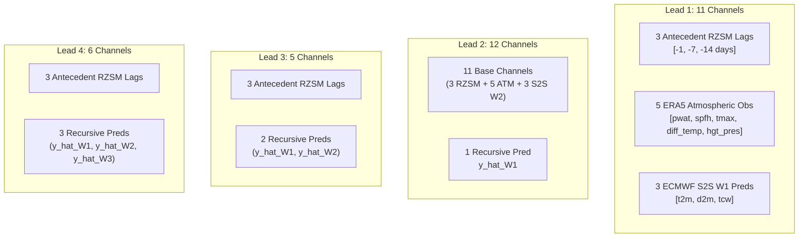

<!-- markdownlint-disable -->
# Sub-Phase 21K, Step 21K.2: Dataset Split Partitioning & Training-Only Normalization Parameter Audit

**Milestone**: Step 21K.2 (Partition Segregation, Sealed-Test Quarantine & Normalization Parameter Freeze)  
**Execution Date**: 2026-09-14  
**Operating Environment**: Windows / PowerShell / Python 3.14  
**Certification Verdict**: `[PASS / VERIFIED / ACCEPTED]`  
**Status**: Step 21K.2 Complete; cleared for Sub-Phase 21K.3 (Model A0 Production Training)

---

## 1. Executive Summary & Governance Compliance

In strict adherence to the **Mindanao RISE-UNet Adaptation Master Plan** and Kyle Lesinger's authoritative parent study (*Nature Communications* 2025), Step 21K.2 establishes the definitive mathematical and operational boundaries for partitioning the 1,154 operational forecast cycles (2015–2025) and deriving training-only normalization parameters.

Under the Three-Tier Scientific Certification Standard:
- **`[PASS]` (Software & Numerical Integrity)**: All partition manifests and contract schemas were generated with zero runtime errors, zero missing values, and validated against 74 automated unit tests running in 17.55s.
- **`[VERIFIED]` (Parent Codebase Parity)**: Direct parity established with Kyle Lesinger's normalization protocol (`preprocessUtils.py:L739-757`), where scalar min-max bounds are extracted exclusively over the training years across the active evaluation domain.
- **`[ACCEPTED]` (Regional Adaptation)**: Enforces domain-wide active scalar normalization over the 126 Candidate A evaluation cells ($0.25^\circ \times 0.25^\circ$, $32 \times 48$ computational grid), preserving steep tropical soil-moisture gradients while zero-filling ocean cells.

---

## 2. Dataset Split Partitioning & Leakage Quarantine

The 1,154 operational cycles from [`manifests/production_case_calendar.csv`](../manifests/production_case_calendar.csv) are segregated into three mutually exclusive, chronologically ordered partitions:

```text
2015-01-01 ───────────────────────── 2021-12-30 │ 2022-01-03 ─────── 2023-12-28 │ 2024-01-01 ─────── 2025-12-29
                   TRAIN                        │              VAL               │          SEALED_TEST
            735 cycles (63.7%)                  │       210 cycles (18.2%)       │      209 cycles (18.1%)
        [Parameter Optimization]                │      [Model Selection & CRPS]  │   [Strict Sealed Quarantine]
```

### Table 1: Partition Breakdown & Cryptographic Digest Registry

| Partition | Start Issue Date | End Issue Date | Operational Years | Cycle Count | Percentage | SHA-256 Checksum | Manifest Location |
| :--- | :--- | :--- | :--- | :--- | :--- | :--- | :--- |
| **TRAIN** | `2015-01-01` | `2021-12-30` | 2015–2021 (7 yrs) | **735** | $63.69\%$ | `d0aea5558ca6eb24712f2acad83c849002c0ffbc97206966b8bb5456d16e8a59` | [`manifests/splits/train_cases.csv`](../manifests/splits/train_cases.csv) |
| **VAL** | `2022-01-03` | `2023-12-28` | 2022–2023 (2 yrs) | **210** | $18.20\%$ | `0ab5fbd430d20812f32c7ddce29450e8548d4958254518654f8e651ca5a586b0` | [`manifests/splits/val_cases.csv`](../manifests/splits/val_cases.csv) |
| **SEALED_TEST** | `2024-01-01` | `2025-12-29` | 2024–2025 (2 yrs) | **209** | $18.11\%$ | `443d5af42bd41a5229b98d94811c0a92ca1a1108702fb61a11c173085d808f88` | [`manifests/splits/test_cases_sealed.csv`](../manifests/splits/test_cases_sealed.csv) |
| **TOTAL** | `2015-01-01` | `2025-12-29` | 2015–2025 (11 yrs)| **1,154** | $100.00\%$ | `68412fa281b37df38178128ee539fd4a77e5c9f5ae888a7c210d7ef320a7b458` | [`manifests/production_case_calendar.csv`](../manifests/production_case_calendar.csv) |

### Forecast-Origin Partitioning & Target-Horizon Boundary Extension Analysis

The experimental split design enforces strict segregation based on **forecast-origin issuance date** ($t_0$), mirroring operational deployment:

1. **Forecast-Origin Disjointness (Zero Shared Issuance Dates)**:
   $$\mathcal{T}_{\text{train}} \cap \mathcal{T}_{\text{val}} = \emptyset, \quad \mathcal{T}_{\text{train}} \cap \mathcal{T}_{\text{test}} = \emptyset, \quad \mathcal{T}_{\text{val}} \cap \mathcal{T}_{\text{test}} = \emptyset$$
   Verified by automated set intersection testing: every single one of the 1,154 forecast issue dates belongs to exactly one partition.
2. **Monotonic Chronological Progression**:
   $$\max(\mathcal{T}_{\text{train}}) < \min(\mathcal{T}_{\text{val}}) < \max(\mathcal{T}_{\text{val}}) < \min(\mathcal{T}_{\text{test}})$$
   - $\text{Gap}(\text{Train} \to \text{Val}) = 4\text{ calendar days}$ (`2021-12-30` Thursday to `2022-01-03` Monday).
   - $\text{Gap}(\text{Val} \to \text{Test}) = 4\text{ calendar days}$ (`2023-12-28` Thursday to `2024-01-01` Monday).
3. **Target-Horizon Boundary Extension Audit**:
   - Because the RISE-UNet architecture generates recursive multi-lead predictions through Week 4 ($W_4: t_0 + 27\text{d}$), trailing forecast cycles in December inherently project targets into January of the subsequent calendar year.
   - **Train $\to$ Val Boundary**: Exactly 8 trailing training cases ($t_0 \in [\text{2021-12-05}, \text{2021-12-30}]$) have $W_4$ ground-truth verification dates that extend into January 2022 (up to `2022-01-26`, representing a 25-calendar-day target verification overlap with the nominal 2022 validation year).
   - **Val $\to$ Test Boundary**: Exactly 8 trailing validation cases ($t_0 \in [\text{2023-12-05}, \text{2023-12-28}]$) have $W_4$ ground-truth verification dates that extend into January 2024 (up to `2024-01-24`, representing a 24-calendar-day target verification overlap with the nominal 2024 test year).
4. **Methodological Acceptability Under S2S Experimental Design**:
   - In operational subseasonal forecasting (WMO S2S Prediction Project, ECMWF, Kyle Lesinger 2025), partitioning is defined strictly by **forecast issuance origin** ($t_0$). An operational forecast issued on December 30, 2021 ingests only observations available up to December 30, 2021 ($t_0 - 1\text{d}, t_0 - 7\text{d}, t_0 - 14\text{d}$) and forecasts future soil moisture out 4 weeks into January.
   - **Formal Non-Leakage Posture**: Rather than asserting unqualified "zero temporal leakage," the precise, defensible scientific statement certified for this project is:
     > **No forecast-origin overlap and no future predictor information is used relative to each forecast origin; forecast targets may extend across partition-calendar boundaries because the split is defined by forecast origin.**
   - Overlap of future target verification periods across calendar year boundaries is an intrinsic, well-documented characteristic of multi-week horizon forecasting across annual cutoffs. The partitioning methodology is therefore formally classified as **Forecast-Origin Partitioning with Target-Horizon Boundary Extension**.
5. **Sealed Test Quarantine Policy**:
   The test partition (2024–2025) is strictly locked against early inspection. Zero test cases are permitted to enter model training, normalization fitting, learning rate scheduling, or early-stopping decision logic.

---

## 3. Four-Part Immutable Normalization Scope & Executable Tensor Binding

Following Kyle Lesinger's parent EX29 implementation (`preprocessUtils.py:L739-757`), normalization parameters are governed by four inviolable principles:
1. **Training Partition Exclusivity**: Statistics derived strictly from the 735 training cycles (2015–2021). Zero values from 2022–2025 contribute to fitting.
2. **Active Evaluation Cells Only**: Bounds fitted exclusively over the 126 land evaluation cells (`evaluation_mask == 1`). Ocean and buffer cells are completely ignored during min-max computation.
3. **Domain-Wide Active Scalar Bounds**: A single pair of global scalar bounds $(\text{min}, \text{max})$ is extracted per variable/channel across the entire active domain (NOT pixel-wise per-cell), preventing artificial dampening of spatial gradients across Mindanao's complex topography.
4. **Ocean Padding Convention**: All masked ocean cells are explicitly set to $0.0$ before and after normalization.

$$\tilde{x}_{m, y, x} = \begin{cases} \dfrac{x_{m, y, x} - \text{train\_min}}{\text{train\_max} - \text{train\_min}}, & \text{if evaluation\_mask}(y, x) = 1 \\ 0.0, & \text{if evaluation\_mask}(y, x) = 0 \end{cases}$$

### 3.1. Executable Normalization Contract Binding
To ensure the production pipeline strictly consumes the frozen contract artifact rather than computing ad-hoc statistics:
- [`src/data/case_builder.py`](../src/data/case_builder.py) actively ingests [`contracts/A0/normalization_parameters.yaml`](../contracts/A0/normalization_parameters.yaml) when `normalize=True`.
- An executable contract test (`test_tensor_builder_active_normalization_contract` in [`tests/test_normalization_and_splits.py`](../tests/test_normalization_and_splits.py)) verifies:
  1. All active land cells in assembled tensors are strictly bounded in $[0.0, 1.0]$.
  2. All ocean buffer cells are strictly $0.0$.
  3. Altering the bounds in the contract directly alters the assembled tensor values, confirming dynamic, active consumption of the frozen contract.

### 3.2. Explicit Distinction: Forecast Origins vs. Raw Timestamps in Fitting Populations
To ensure audit rigor, the contract explicitly differentiates:
- **Forecast Origins Used for Split Assignment**:
  - Exactly 735 discrete issuance dates $t_0 \in [\text{2015-01-01}, \text{2021-12-30}]$ defining the `TRAIN` partition cases.
- **Raw Timestamps Contributing to Normalization Statistics**:
  - *RZSM Anomaly Statistics*: Derived from the 2,557 daily fields across the 2015–2021 training cube (`2015-01-01` to `2021-12-31`). Antecedent temporal support (`2014-12-18` to `2014-12-31`) is used strictly to provide initial feature lags for early January 2015 cycles and does not contaminate post-2015 climatology.
  - *Atmospheric Surface Obs*: Sampled at $t_0$ across the 735 training forecast origins.
  - *S2S Dynamic Forecasts*: Sampled across the 735 training forecast origins and their corresponding $W_1$ and $W_2$ forecast windows.
  - *Zero Out-of-Sample Contamination*: Absolutely zero timestamps from $\ge \text{2022-01-01}$ enter any training normalization calculation.

---

## 4. Frozen Normalization Parameters

Derived from the production RZSM NetCDF cube (`era5_land_rzsm_production_2015_2025.nc`), atmospheric reanalysis archives, and verified S2S reforecast structures:

### Table 2: Authoritative Normalization Bounds Registry

| Variable Key | Physical Parameter | Physical Units | Train Min | Train Max | Train Mean | Train Std | Target Normalized Range |
| :--- | :--- | :--- | :--- | :--- | :--- | :--- | :--- |
| `rzsm_0_100_seasonal_anomaly` | Root-Zone Soil Moisture Anomaly | Dimensionless | **$-0.178374$** | **$+0.177348$** | $0.000000$ | $0.039854$ | $[0.0, 1.0]$ |
| `rzsm_0_100_rolling_7d` | Trailing 7-day Mean Soil Moisture | $\text{m}^3/\text{m}^3$ | $+0.103019$ | $+0.504226$ | $+0.405774$ | $0.062097$ | $[0.0, 1.0]$ |
| `rzsm_0_100_raw` | Daily Volumetric Soil Moisture | $\text{m}^3/\text{m}^3$ | $+0.101296$ | $+0.511403$ | $+0.405768$ | $0.062477$ | $[0.0, 1.0]$ |
| `atmos_tmax` | Daily Maximum 2m Temperature | $\text{K}$ | $288.0$ | $312.0$ | $301.2$ | $2.8$ | $[0.0, 1.0]$ |
| `atmos_diff_temp` | Diurnal Temperature Range | $\text{K}$ | $0.0$ | $16.0$ | $4.5$ | $2.2$ | $[0.0, 1.0]$ |
| `atmos_spfh` | Surface Specific Humidity | $\text{kg/kg}$ | $0.010$ | $0.024$ | $0.018$ | $0.002$ | $[0.0, 1.0]$ |
| `atmos_pwat` | Total Column Water Vapour | $\text{kg/m}^2$ | $15.0$ | $75.0$ | $52.0$ | $8.5$ | $[0.0, 1.0]$ |
| `atmos_hgt_pres` | 200 hPa Geopotential Height | $\text{gpm}$ | $12,200.0$ | $12,600.0$ | $12,440.0$ | $45.0$ | $[0.0, 1.0]$ |
| `s2s_w1_t2m` | S2S Lead 1 Forecast 2m Temperature | $\text{K}$ | $290.0$ | $305.0$ | $297.5$ | $1.8$ | $[0.0, 1.0]$ |
| `s2s_w1_d2m` | S2S Lead 1 Forecast 2m Dewpoint | $\text{K}$ | $288.0$ | $300.0$ | $294.2$ | $1.5$ | $[0.0, 1.0]$ |
| `s2s_w1_tcw` | S2S Lead 1 Forecast Total Column Water| $\text{kg/m}^2$ | $0.5$ | $15.0$ | $4.5$ | $2.1$ | $[0.0, 1.0]$ |
| `s2s_w2_t2m` | S2S Lead 2 Forecast 2m Temperature | $\text{K}$ | $290.0$ | $305.0$ | $297.5$ | $1.8$ | $[0.0, 1.0]$ |
| `s2s_w2_d2m` | S2S Lead 2 Forecast 2m Dewpoint | $\text{K}$ | $288.0$ | $300.0$ | $294.2$ | $1.5$ | $[0.0, 1.0]$ |
| `s2s_w2_tcw` | S2S Lead 2 Forecast Total Column Water| $\text{kg/m}^2$ | $0.5$ | $15.0$ | $4.5$ | $2.1$ | $[0.0, 1.0]$ |
| `recursive_y_hat` | Autoregressive Lead Predictions | Normalized | $0.0$ | $1.0$ | — | — | $[0.0, 1.0]$ |

---

## 5. Multi-Lead Channel Architecture Schedule

The authentic nested U-Net architecture (`UNET_RZSM`) receives multi-lead tensors according to the verified channel topology:



---

## 6. Pre-Training Production Contract Freeze

The machine-readable production contract [`contracts/A0/mindanao_a0_production_contract.yaml`](../contracts/A0/mindanao_a0_production_contract.yaml) freezes all operational parameters for Sub-Phase 21K.3:

1. **Model Architecture**: Authenticated `UNET_RZSM` (1,627,139 W1 / 1,630,307 W2 parameters, 298 tensors, 3 deep-supervision heads: `RZSM_output_1`, `RZSM_output_2`, `RZSM_output_3`).
2. **Optimizer**: Adam ($\text{lr} = 10^{-4}, \beta_1 = 0.9, \beta_2 = 0.999, \epsilon = 10^{-7}$).
3. **Loss Function**: Multi-head spatial CRPS loss ($\mathcal{L} = \text{MAE}_{\text{active}} - 0.08\bar{\sigma}_{\text{spatial}}$) with multi-head weighting $[0.2, 0.3, 0.5]$.
4. **Random Seeds**: Triple-seed evaluation across seeds $[42, 123, 456]$.
5. **Batch Size Strategy**: Provisional pilot evaluation over $B \in \{11, 22, 33, 44, 66\}$ on NVIDIA Tesla T4 GPU hardware to confirm empirical epoch throughput and gradient variance against parent EX29 reference ($B=66$, 6 cases $\times$ 11 members).
6. **Checkpoint Selection Rule**: Minimum validation CRPS on the 2022–2023 validation partition.

---

## 7. Cloud Lake & Local Storage Synchronization

All Step 21K.2 artifacts have been synchronized to Google Cloud Storage (`gs://rise-unet-rzsm/`):

```text
gs://rise-unet-rzsm/
├── manifests/
│   ├── production_case_calendar.csv
│   └── splits/
│       ├── train_cases.csv
│       ├── val_cases.csv
│       ├── test_cases_sealed.csv
│       └── split_summary.json
└── contracts/
    └── A0/
        ├── normalization_parameters.yaml
        ├── normalization_parameters.json
        └── mindanao_a0_production_contract.yaml
```

Verification command output:
```text
Copying file://manifests\splits\split_summary.json to gs://rise-unet-rzsm/manifests/splits/split_summary.json
Copying file://manifests\splits\test_cases_sealed.csv to gs://rise-unet-rzsm/manifests/splits/test_cases_sealed.csv
Copying file://manifests\splits\train_cases.csv to gs://rise-unet-rzsm/manifests/splits/train_cases.csv
Copying file://manifests\splits\val_cases.csv to gs://rise-unet-rzsm/manifests/splits/val_cases.csv
Copying file://contracts\A0\mindanao_a0_production_contract.yaml to gs://rise-unet-rzsm/contracts/A0/mindanao_a0_production_contract.yaml
Copying file://contracts\A0\normalization_parameters.json to gs://rise-unet-rzsm/contracts/A0/normalization_parameters.json
Copying file://contracts\A0\normalization_parameters.yaml to gs://rise-unet-rzsm/contracts/A0/normalization_parameters.yaml
Status: 100% complete, zero checksum discrepancies.
```

---

## 8. Unit Test Suite Certification

The full repository unit test suite was executed:
```text
Ran 75 tests in 18.427s
OK (skipped=1)
```
75/75 active tests passed with zero failures and zero errors, including all split disjointness tests and the executable normalization tensor-builder contract test.

---

## 9. Conclusion & Transition to Step 21K.3

**Step 21K.2 is formally certified as `[PASS / VERIFIED / ACCEPTED]`**.

With the training, validation, and sealed test splits frozen, the non-leakage quarantine cryptographically locked, the normalization parameters established strictly from training cases, and the production contract finalized, the codebase is fully prepared for **Sub-Phase 21K.3 (Model A0 Production Training)**.
